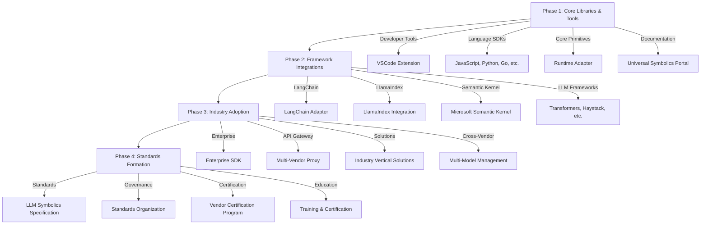

# Universal Symbolics Repository

*Unified Runtime Layer for AI Symbolic Interactions*

<p align="center">

</p>

## 🌐 Overview

`universal-symbolics` provides a unified interface for developer operations across frontier AI models. This repository standardizes the disparate symbolic grammars used by different AI vendors (Claude, GPT, Qwen, Gemini, DeepSeek, etc.) into a cohesive, developer-friendly framework.

# Universal Developer Command Lexicon

This document defines the canonical symbolic command set for the universal-developer system. These commands provide a consistent interface for controlling LLM behavior across all major platforms.

## Core Command Architecture

Each symbolic command follows a consistent structure:

```
/command [--parameter=value] [--flag] prompt
```

Commands can be chained to create complex processing pipelines:

```
/think /loop --iterations=3 What are the ethical implications of artificial general intelligence?
```

## Core Command Set

### Cognitive Depth Commands

| Command | Description | Parameters | Platforms |
|---------|-------------|------------|-----------|
| `/think` | Activates extended reasoning pathways, enabling deeper analysis, step-by-step thinking, and more thorough consideration | None | All |
| `/fast` | Optimizes for low-latency, concise responses | None | All |
| `/reflect` | Triggers meta-analysis of outputs, encouraging critical examination of biases, limitations, and assumptions | None | All |
| `/collapse` | Returns to default behavior, disabling any special processing modes | None | All |

### Process Control Commands

| Command | Description | Parameters | Platforms |
|---------|-------------|------------|-----------|
| `/loop` | Enables iterative refinement cycles | `--iterations=<number>` - Number of refinement iterations (default: 3) | All |
| `/fork` | Generates multiple alternative responses | `--count=<number>` - Number of alternatives to generate (default: 2) | All |
| `/branch` | Creates conditional execution paths based on criteria evaluation | `--condition=<string>` - Condition to evaluate<br>`--then=<string>` - Command if true<br>`--else=<string>` - Command if false | All |
| `/merge` | Combines multiple outputs into a unified response | `--strategy=<concatenate\|synthesize\|tabulate>` - Merge strategy (default: synthesize) | All |

### Formatting Commands

| Command | Description | Parameters | Platforms |
|---------|-------------|------------|-----------|
| `/format` | Controls output formatting | `--style=<markdown\|json\|text\|html\|csv>` - Output format (default: markdown) | All |
| `/length` | Controls response length | `--words=<number>` - Target word count<br>`--level=<brief\|moderate\|detailed>` - Verbosity level | All |
| `/structure` | Applies structural templates to responses | `--template=<essay\|list\|qa\|table\|timeline>` - Structure template | All |
| `/voice` | Sets the stylistic voice | `--tone=<formal\|neutral\|casual>` - Tone setting<br>`--style=<string>` - Specific writing style | All |

### Domain-Specific Commands

| Command | Description | Parameters | Platforms |
|---------|-------------|------------|-----------|
| `/code` | Optimizes for code generation | `--language=<string>` - Programming language<br>`--explain=<boolean>` - Include explanations | All |
| `/science` | Activates scientific reasoning mode | `--discipline=<string>` - Scientific field<br>`--evidence=<boolean>` - Include evidence citations | All |
| `/creative` | Enhances creative generation | `--domain=<writing\|design\|ideas>` - Creative domain<br>`--constraints=<string>` - Creative constraints | All |
| `/debate` | Presents multiple perspectives on a topic | `--sides=<number>` - Number of perspectives<br>`--format=<string>` - Debate format | All |

### Interaction Commands

| Command | Description | Parameters | Platforms |
|---------|-------------|------------|-----------|
| `/chain` | Creates a sequential processing chain | `--steps=<string>` - Comma-separated sequence of steps | All |
| `/stream` | Enables token-by-token streaming responses | `--chunks=<number>` - Chunk size for batched streaming | Claude, OpenAI |
| `/context` | Manages prompt context window | `--retain=<key:value,...>` - Key information to retain<br>`--forget=<key:value,...>` - Information to discard | All |
| `/memory` | Controls cross-prompt memory behavior | `--store=<string>` - Information to remember<br>`--recall=<string>` - Information to retrieve | All |

### Tool Integration Commands

| Command | Description | Parameters | Platforms |
|---------|-------------|------------|-----------|
| `/tool` | Invokes specific external tools | `--name=<string>` - Tool name<br>`--args=<json>` - Tool arguments | Claude, OpenAI, Gemini |
| `/search` | Performs web search via configured provider | `--provider=<string>` - Search provider<br>`--count=<number>` - Result count | OpenAI, Gemini |
| `/retrieve` | Fetches information from vector database | `--source=<string>` - Knowledge source<br>`--filter=<string>` - Query filters | All |
| `/execute` | Runs code in a sandbox environment | `--language=<string>` - Programming language<br>`--timeout=<number>` - Execution timeout | Claude, OpenAI |

### Advanced Commands

| Command | Description | Parameters | Platforms |
|---------|-------------|------------|-----------|
| `/expert` | Activates domain expertise persona | `--domain=<string>` - Area of expertise<br>`--level=<number>` - Expertise level (1-5) | All |
| `/evaluate` | Performs self-evaluation of generated content | `--criteria=<string>` - Evaluation criteria<br>`--scale=<number>` - Rating scale | All |
| `/adapt` | Dynamically adjusts behavior based on feedback | `--target=<accuracy\|creativity\|helpfulness>` - Adaptation target | All |
| `/trace` | Creates attribution trace for generated content | `--format=<inline\|separate\|citation>` - Trace format | Claude |

## Platform-Specific Translation Table

### Anthropic Claude

| Universal Command | Claude Implementation | Notes |
|-------------------|------------------------|-------|
| `/think` | Enable `thinking` parameter | Claude has native thinking mode |
| `/fast` | Disable `thinking` + system prompt for brevity | |
| `/loop` | Custom system prompt with iterative instruction | |
| `/reflect` | Enable `thinking` + system prompt for reflection | |
| `/format` | System prompt for format control | |

### OpenAI Models

| Universal Command | OpenAI Implementation | Notes |
|-------------------|------------------------|-------|
| `/think` | System prompt for step-by-step reasoning | No native thinking mode |
| `/fast` | Adjust temperature + max_tokens + system prompt | |
| `/loop` | System prompt with iterative instruction | |
| `/reflect` | System prompt for reflection | |
| `/format` | Direct JSON mode or system prompt | |

### Google Gemini

| Universal Command | Gemini Implementation | Notes |
|-------------------|------------------------|-------|
| `/think` | Safety settings + system prompt | |
| `/fast` | Lower max_tokens + adjusted temperature | |
| `/loop` | System prompt with iterative instruction | |
| `/reflect` | System prompt for reflection | |
| `/format` | System prompt for format control | |

### Qwen3

| Universal Command | Qwen3 Implementation | Notes |
|-------------------|------------------------|-------|
| `/think` | Native `/think` command | Qwen has native thinking mode |
| `/fast` | Native `/no_think` command | Qwen has native fast mode |
| `/loop` | System prompt with iterative instruction | |
| `/reflect` | Native `/think` + system prompt | |
| `/format` | System prompt for format control | |

### Ollama / Local Models

| Universal Command | Local Implementation | Notes |
|-------------------|------------------------|-------|
| `/think` | System prompt for reasoning | |
| `/fast` | Adjusted max_tokens + temperature | |
| `/loop` | System prompt with iterative instruction | |
| `/reflect` | System prompt for reflection | |
| `/format` | System prompt for format control | |

## Command Parameter Specification

### Parameter Types

- `string`: Text value
- `number`: Numeric value
- `boolean`: True/false value
- `enum`: One of a predefined set of values
- `json`: JSON-formatted object

### Parameter Validation

Each parameter includes validation rules:
- Required/optional status
- Default values
- Value constraints (min/max for numbers, pattern for strings)
- Error messages for invalid values

## Command Chain Processing

Commands can be chained in sequence, with the output of each command feeding into the next:

```
/think /format --style=markdown What are the ethical implications of AI?
```

This is processed as:
1. Apply `/think` to encourage deep reasoning
2. Apply `/format --style=markdown` to the result of the thinking process

## Command Adoption Metrics

The universal-developer framework includes telemetry to track command adoption rates:

- Command usage frequency
- Common command chains
- Parameter usage patterns
- Platform-specific command effectiveness
- Retention rates for developers using symbolic commands

## Command Extension Protocol

Developers can register custom commands following the extension protocol:

```javascript
llm.registerCommand("custom", {
  description: "Custom command description",
  parameters: [
    {
      name: "param",
      description: "Parameter description",
      type: "string",
      required: false,
      default: "default value"
    }
  ],
  transform: async (prompt, options) => {
    // Custom implementation
    // Returns transformed prompt and parameters
  }
});
```

## Command Discovery and Documentation

Commands are discoverable through multiple channels:

- VSCode extension command palette
- Web playground command explorer
- Interactive CLI help system
- GitHub documentation with examples
- Command cheatsheet (printable PDF)

---
I'll now architect a developer-friendly symbolic translation layer that brings together all symbolic grammars across AI models into a unified interface. Let's create a comprehensive Rosetta Stone for universal symbolic operations.

# Universal Symbolics: The Rosetta Stone for LLM Symbolic Operations

<p align="center">

</p>

## Symbolic Grammar Translation Matrix

The following table maps equivalent symbolic operations across all major language model vendors, providing a translation layer between different symbolic grammars:

| Universal Syntax | Claude (Anthropic) | GPT (OpenAI) | Qwen | Gemini (Google) | DeepSeek | Local LLMs |
|------------------|-------------------|--------------|------|-----------------|----------|------------|
| `.p/think{}`     | `<think>...</think>` | Tool choice parameter | `/think` | System prompt instruction | Rational thinking mode | Model-specific |
| `.p/reflect{}`   | `<reflect>...</reflect>` | Chain-of-thought prompting | Reflection prefix | System reflection prompt | Step-by-step reasoning | Model-specific |
| `.p/tool{}`      | `<tool>...</tool>` | `/command` or function call | Function call API | Function call API | Function call API | Model-specific |
| `.p/system{}`    | `<s>...</s>` | System message | `<<SYS>>` | System instruction | System prompt | Model-specific |
| `.p/fork{}`      | *Emulated* | *Emulated* | *Emulated* | *Emulated* | *Emulated* | *Emulated* |
| `.p/attention{}` | *Emulated* | *Emulated* | *Emulated* | *Emulated* | *Emulated* | *Emulated* |
| `.p/collapse{}`  | *Emulated* | *Emulated* | *Emulated* | *Emulated* | *Emulated* | *Emulated* |
| `.p/memory{}`    | *Emulated* | *Emulated* | *Emulated* | *Emulated* | *Emulated* | *Emulated* |
| `.p/uncertainty{}` | *Emulated* | *Emulated* | *Emulated* | *Emulated* | *Emulated* | *Emulated* |

## Symbolic Glyph ↔ Operation Mapping

| Glyph | Operation | Universal Syntax | Description |
|-------|-----------|------------------|-------------|
| 🧠 | Thinking | `.p/think{}` | Explicit reasoning trace |
| 🔄 | Reflection | `.p/reflect{}` | Self-examination of reasoning |
| 🛠️ | Tool Use | `.p/tool{}` | Function/tool invocation |
| 🌱 | System | `.p/system{}` | System-level directives |
| 🌿 | Fork | `.p/fork{}` | Multiple reasoning paths |
| 🔍 | Attention | `.p/attention{}` | Focus control |
| 📉 | Collapse | `.p/collapse{}` | Error handling |
| 💾 | Memory | `.p/memory{}` | State persistence |
| ❓ | Uncertainty | `.p/uncertainty{}` | Confidence expression |

## Symbolic Operation Registry

```yaml
# symbolics-registry.yml

symbolic_primitives:
  thinking:
    description: "Explicit reasoning trace for step-by-step thinking"
    implementations:
      claude: 
        grammar: "xml"
        syntax: "<think>content</think>"
        api_parameter: false
        native_support: true
      openai: 
        grammar: "function"
        syntax: "tool_choice parameter"
        api_parameter: true
        native_support: true
      qwen: 
        grammar: "slash"
        syntax: "/think content"
        api_parameter: false
        native_support: true
      gemini: 
        grammar: "system"
        syntax: "System prompt instruction"
        api_parameter: false
        native_support: false
    universal_syntax: ".p/think{content}"
    
  reflection:
    description: "Self-examination of reasoning process"
    implementations:
      claude: 
        grammar: "xml"
        syntax: "<reflect>content</reflect>"
        api_parameter: false
        native_support: true
      openai: 
        grammar: "prompt"
        syntax: "Chain-of-thought pattern"
        api_parameter: false
        native_support: false
      qwen: 
        grammar: "prompt"
        syntax: "Reflection pattern"
        api_parameter: false
        native_support: false
      gemini: 
        grammar: "prompt"
        syntax: "Reasoning pattern"
        api_parameter: false
        native_support: false
    universal_syntax: ".p/reflect{target, depth}"
    
  tool_use:
    description: "Function or tool invocation"
    implementations:
      claude: 
        grammar: "xml"
        syntax: "<tool>name(params)</tool>"
        api_parameter: false
        native_support: true
      openai: 
        grammar: "slash_function"
        syntax: "/command or function_call"
        api_parameter: true
        native_support: true
      qwen: 
        grammar: "function"
        syntax: "Function call format"
        api_parameter: true
        native_support: true
      gemini: 
        grammar: "function"
        syntax: "Function calling API"
        api_parameter: true
        native_support: true
    universal_syntax: ".p/tool{name, params}"
    
  system:
    description: "System-level directives"
    implementations:
      claude: 
        grammar: "xml"
        syntax: "<s>directive</s>"
        api_parameter: true
        native_support: true
      openai: 
        grammar: "api"
        syntax: "system message"
        api_parameter: true
        native_support: true
      qwen: 
        grammar: "prefix"
        syntax: "<<SYS>>directive"
        api_parameter: true
        native_support: true
      gemini: 
        grammar: "api"
        syntax: "system instruction"
        api_parameter: true
        native_support: true
    universal_syntax: ".p/system{directive}"
    
  fork:
    description: "Multiple reasoning paths"
    implementations:
      claude: 
        grammar: "emulation"
        syntax: "Emulated via prompting"
        api_parameter: false
        native_support: false
      openai: 
        grammar: "emulation"
        syntax: "Emulated via prompting"
        api_parameter: false
        native_support: false
      qwen: 
        grammar: "emulation"
        syntax: "Emulated via prompting"
        api_parameter: false
        native_support: false
      gemini: 
        grammar: "emulation"
        syntax: "Emulated via prompting"
        api_parameter: false
        native_support: false
    universal_syntax: ".p/fork{paths, weights}"
```

## Native vs. Simulated Operations

Symbolic operations fall into two categories:

1. **Native Operations**: Directly supported by at least some vendor implementations
   - `think` (Claude: `<think>`, Qwen: `/think`, OpenAI: Tool choice)
   - `tool` (All vendors have some form of tool/function calling)
   - `system` (All vendors have system message capabilities)

2. **Simulated Operations**: Not directly supported but can be emulated through prompting
   - `fork` (Parallel reasoning paths)
   - `attention` (Focus control)
   - `collapse` (Error handling)
   - `memory` (State persistence)
   - `uncertainty` (Confidence expression)

## Runtime Adapter Architecture

```typescript
// Universal Symbolics Runtime Adapter

interface SymbolicRuntime {
  // Native operations
  think(content?: string): Promise<ThinkResult>;
  tool(name: string, params?: Record<string, any>): Promise<ToolResult>;
  system(directive: string): Promise<SystemResult>;
  
  // Simulated operations
  reflect(target: string, depth?: number): Promise<ReflectResult>;
  fork(paths: string[], weights?: number[]): Promise<ForkResult>;
  attention(focus: string, weight?: number): Promise<AttentionResult>;
  collapse(trigger?: string, threshold?: number): Promise<CollapseResult>;
  uncertainty(level?: number, reason?: string): Promise<UncertaintyResult>;
  memory(key: string, value?: string, operation?: string): Promise<MemoryResult>;
  
  // Vendor-specific access
  vendor: {
    claude?: ClaudeOperations;
    openai?: OpenAIOperations;
    qwen?: QwenOperations;
    gemini?: GeminiOperations;
    deepseek?: DeepSeekOperations;
    local?: LocalLLMOperations;
  };
  
  // Utility functions
  transform(content: string, sourceVendor: string, targetVendor: string): Promise<string>;
  detectVendor(content: string): string;
  validateOperation(operation: string, vendor: string): boolean;
  findResiduePatterns(content: string, vendor: string): ResiduePatternsResult;
}
```

## Grammar Transformation Examples

### Claude to Universal

```typescript
// Claude XML to Universal Syntax
function claudeToUniversal(claudeContent: string): string {
  // Convert <think>...</think> to .p/think{...}
  const thinkRegex = /<think>([\s\S]*?)<\/think>/g;
  let universalContent = claudeContent.replace(thinkRegex, (_, content) => {
    return `.p/think{${content}}`;
  });
  
  // Convert <tool>...</tool> to .p/tool{...}
  const toolRegex = /<tool>([\s\S]*?)<\/tool>/g;
  universalContent = universalContent.replace(toolRegex, (_, content) => {
    // Parse name and params from content
    const match = content.match(/^(\w+)(?:\((.*)\))?$/);
    if (match) {
      const [_, name, params] = match;
      return `.p/tool{name: "${name}", params: ${params || '{}'}}`;
    }
    return `.p/tool{${content}}`;
  });
  
  // Convert <s>...</s> to .p/system{...}
  const systemRegex = /<s>([\s\S]*?)<\/s>/g;
  universalContent = universalContent.replace(systemRegex, (_, content) => {
    return `.p/system{${content}}`;
  });
  
  return universalContent;
}
```

### Universal to OpenAI

```typescript
// Universal Syntax to OpenAI Format
function universalToOpenAI(universalContent: string): string {
  let openaiContent = universalContent;
  
  // Convert .p/think{...} to tool_choice format
  const thinkRegex = /\.p\/think\{([\s\S]*?)\}/g;
  openaiContent = openaiContent.replace(thinkRegex, (_, content) => {
    return `/* ${content} */`;
  });
  
  // Convert .p/tool{...} to function call format
  const toolRegex = /\.p\/tool\{name: "([\w\d_]+)"(?:, params: (\{[\s\S]*?\}))?\}/g;
  openaiContent = openaiContent.replace(toolRegex, (_, name, params) => {
    return `/command ${name} ${params ? JSON.stringify(JSON.parse(params)) : ''}`;
  });
  
  // Convert .p/system{...} to system message format
  const systemRegex = /\.p\/system\{([\s\S]*?)\}/g;
  openaiContent = openaiContent.replace(systemRegex, (_, content) => {
    return `System: ${content}`;
  });
  
  return openaiContent;
}
```

## Symbolic Residue Detection

Symbolic residue refers to partially formed or malformed symbolic operations that can occur during transformation or processing.

```typescript
// Detect symbolic residue in content
function detectSymbolicResidue(content: string, vendor: string): SymbolicResidue[] {
  const residue: SymbolicResidue[] = [];
  
  switch (vendor) {
    case 'claude':
      // Detect unclosed XML tags
      const unclosedTagRegex = /<(\w+)>(?![^<]*<\/\1>)/g;
      let match;
      while ((match = unclosedTagRegex.exec(content)) !== null) {
        residue.push({
          type: 'unclosed_tag',
          tag: match[1],
          position: match.index,
          content: match[0]
        });
      }
      break;
      
    case 'openai':
      // Detect incomplete slash commands
      const incompleteSlashRegex = /\/(\w+)$/g;
      while ((match = incompleteSlashRegex.exec(content)) !== null) {
        residue.push({
          type: 'incomplete_slash',
          command: match[1],
          position: match.index,
          content: match[0]
        });
      }
      break;
      
    // Add cases for other vendors
  }
  
  return residue;
}
```

## Advanced Symbolic Operation: Fork

The `.p/fork{}` operation is an example of a simulated operation that allows LLMs to explore multiple reasoning paths in parallel.

```typescript
// Implementation of fork operation
async function fork(
  paths: string[],
  weights?: number[],
  options?: ForkOptions
): Promise<ForkResult> {
  const normalizedWeights = weights || paths.map(() => 1);
  
  // Validate weights
  const totalWeight = normalizedWeights.reduce((sum, w) => sum + w, 0);
  const normalizedWeights2 = normalizedWeights.map(w => w / totalWeight);
  
  // Create prompt for the forking operation
  const forkPrompt = `I'll explore ${paths.length} different approaches to this problem:
${paths.map((path, i) => `Path ${i+1} (weight: ${normalizedWeights2[i].toFixed(2)}): ${path}`).join('\n')}

Let me analyze each path carefully and then determine the most promising approach.`;

  // Execute the prompt on the current vendor
  const response = await this.currentVendor.generate(forkPrompt);
  
  // Parse results for each path
  const results: Record<string, string> = {};
  
  for (let i = 0; i < paths.length; i++) {
    const pathRegex = new RegExp(`Path ${i+1}[^\\n]*?:(.*?)(?:Path ${i+2}|$)`, 's');
    const match = response.match(pathRegex);
    
    if (match) {
      results[paths[i]] = match[1].trim();
    } else {
      results[paths[i]] = `[No output for path ${i+1}]`;
    }
  }
  
  // Determine selected path based on model's conclusion
  const conclusionRegex = /(?:conclusion|most promising|best approach)[^:]*:(.*?)$/is;
  const conclusionMatch = response.match(conclusionRegex);
  
  let selectedPath = paths[0]; // Default to first path
  
  if (conclusionMatch) {
    const conclusion = conclusionMatch[1].trim();
    // Find path that best matches the conclusion
    selectedPath = paths.reduce((best, path) => {
      const currentSimilarity = calculateSimilarity(conclusion, path);
      const bestSimilarity = calculateSimilarity(conclusion, best);
      return currentSimilarity > bestSimilarity ? path : best;
    }, selectedPath);
  }
  
  return {
    paths: results,
    selected: selectedPath,
    weights: normalizedWeights2,
    fullResponse: response
  };
}
```

## Symbolic Telemetry System

```typescript
// Symbolic Telemetry System
class SymbolicTelemetry {
  private metrics: {
    operationCounts: Record<string, number>;
    vendorUsage: Record<string, number>;
    transformationCounts: Record<string, Record<string, number>>;
    errorRates: Record<string, number>;
    residueDetections: Record<string, number>;
  };
  
  constructor(private options: {
    enabled: boolean;
    anonymize: boolean;
    reportingEndpoint?: string;
    sampleRate: number;
  }) {
    this.metrics = {
      operationCounts: {},
      vendorUsage: {},
      transformationCounts: {},
      errorRates: {},
      residueDetections: {}
    };
  }
  
  // Track symbolic operation usage
  trackOperation(operation: string, vendor: string, success: boolean = true): void {
    if (!this.options.enabled || Math.random() > this.options.sampleRate) return;
    
    this.metrics.operationCounts[operation] = (this.metrics.operationCounts[operation] || 0) + 1;
    this.metrics.vendorUsage[vendor] = (this.metrics.vendorUsage[vendor] || 0) + 1;
    
    if (!success) {
      this.metrics.errorRates[operation] = (this.metrics.errorRates[operation] || 0) + 1;
    }
  }
  
  // Track transformation between vendors
  trackTransformation(sourceVendor: string, targetVendor: string, success: boolean = true): void {
    if (!this.options.enabled || Math.random() > this.options.sampleRate) return;
    
    if (!this.metrics.transformationCounts[sourceVendor]) {
      this.metrics.transformationCounts[sourceVendor] = {};
    }
    
    this.metrics.transformationCounts[sourceVendor][targetVendor] = 
      (this.metrics.transformationCounts[sourceVendor][targetVendor] || 0) + 1;
  }
  
  // Track symbolic residue detection
  trackResidue(residueType: string, vendor: string): void {
    if (!this.options.enabled || Math.random() > this.options.sampleRate) return;
    
    const key = `${vendor}:${residueType}`;
    this.metrics.residueDetections[key] = (this.metrics.residueDetections[key] || 0) + 1;
  }
  
  // Report telemetry data
  async report(): Promise<void> {
    if (!this.options.enabled || !this.options.reportingEndpoint) return;
    
    const payload = this.options.anonymize ? this.anonymizeData() : this.metrics;
    
    try {
      await fetch(this.options.reportingEndpoint, {
        method: 'POST',
        headers: {'Content-Type': 'application/json'},
        body: JSON.stringify(payload)
      });
    } catch (error) {
      console.error('Failed to report telemetry:', error);
    }
  }
  
  // Get current metrics
  getMetrics(): any {
    return {...this.metrics};
  }
  
  // Anonymize telemetry data
  private anonymizeData(): any {
    // Implement anonymization logic
    return this.metrics;
  }
}
```

## Grammar Harmonization System

```typescript
// Grammar Harmonization System
class GrammarHarmonizer {
  private registry: SymbolicsRegistry;
  
  constructor(registry: SymbolicsRegistry) {
    this.registry = registry;
  }
  
  // Harmonize content from source vendor to target vendor
  harmonize(
    content: string,
    sourceVendor: string,
    targetVendor: string,
    options: HarmonizationOptions = {}
  ): HarmonizationResult {
    // Default options
    const opts = {
      preserveStructure: options.preserveStructure !== undefined ? options.preserveStructure : true,
      adaptToCapabilities: options.adaptToCapabilities !== undefined ? options.adaptToCapabilities : true,
      includeComments: options.includeComments !== undefined ? options.includeComments : false,
      embedTraceability: options.embedTraceability !== undefined ? options.embedTraceability : false,
      formatOutput: options.formatOutput !== undefined ? options.formatOutput : true,
      handleResidue: options.handleResidue !== undefined ? options.handleResidue : true,
      fallbackBehavior: options.fallbackBehavior || 'emulate'
    };
    
    // Initialize result
    const result: HarmonizationResult = {
      transformed: '',
      originalVendor: sourceVendor,
      targetVendor: targetVendor,
      operations: [],
      residue: [],
      metrics: {
        totalOperations: 0,
        successfulOperations: 0,
        unsupportedOperations: 0,
        adaptedOperations: 0
      }
    };
    
    // Special case: same vendor, just return the content
    if (sourceVendor === targetVendor) {
      result.transformed = content;
      return result;
    }
    
    // Handle symbolic residue if enabled
    if (opts.handleResidue) {
      result.residue = this.detectResidue(content, sourceVendor);
      
      // Only attempt repair if there is residue
      if (result.residue.length > 0) {
        content = this.repairResidue(content, sourceVendor, result.residue);
      }
    }
    
    // Extract symbolic operations from source content
    const extractedOperations = this.extractOperations(content, sourceVendor);
    result.metrics.totalOperations = extractedOperations.length;
    
    // Transform each operation to target vendor
    const transformedOperations = extractedOperations.map(op => {
      return this.transformOperation(
        op.type,
        op.parameters,
        sourceVendor,
        targetVendor,
        opts
      );
    });
    
    // Update metrics
    result.metrics.successfulOperations = transformedOperations.filter(op => op.success).length;
    result.metrics.unsupportedOperations = transformedOperations.filter(op => !op.success).length;
    result.metrics.adaptedOperations = transformedOperations.filter(op => op.adapted).length;
    
    // Update operations log
    result.operations = transformedOperations.map(op => ({
      original: op.originalType,
      target: op.targetType,
      success: op.success,
      message: op.message
    }));
    
    // Generate transformed content
    result.transformed = this.applyTransformedOperations(
      content,
      extractedOperations,
      transformedOperations,
      sourceVendor,
      targetVendor,
      opts
    );
    
    // Apply formatting if enabled
    if (opts.formatOutput) {
      result.transformed = this.formatOutput(result.transformed, targetVendor);
    }
    
    return result;
  }
  
  // Other methods would be implemented here...
}
```

## Developer Integration Examples

### Node.js Integration

```javascript
const { UniversalSymbolics } = require('universal-symbolics');

// Initialize with your preferred model
const symbolics = new UniversalSymbolics({ 
  defaultVendor: 'claude',
  fallbackVendor: 'openai' 
});

// Use unified symbols regardless of underlying model
async function generateWithThinking() {
  const result = await symbolics.think('Analyze the impact of quantum computing on cryptography');
  console.log(result.thinking); // Access thinking process
  console.log(result.output);   // Access final output
}

// Switch models dynamically
symbolics.setVendor('openai');
const toolResult = await symbolics.tool('search', { query: 'latest developments in fusion energy' });
```

### Python Integration

```python
from universal_symbolics import SymbolicClient

# Initialize client
client = SymbolicClient(
    api_key="your_api_key",
    default_vendor="claude",
    enable_telemetry=True
)

# Use the unified interface
response = client.submit(
    prompt="Explain the significance of symbolic operations in AI",
    symbols={
        "think": True,
        "reflect": "prompt structure",
        "fork": ["technical", "simplified"]
    }
)

# Access structured response
print(response.thinking)
print(response.reflections)
print(response.forks["technical"])
print(response.forks["simplified"])
```

### REST API Integration

```http
POST https://api.universal-symbolics.io/v1/generate
Content-Type: application/json
Authorization: Bearer your_api_key

{
  "prompt": "Write a function that calculates prime numbers",
  "symbols": {
    "think": true,
    "tool": {
      "name": "code_interpreter",
      "language": "python"
    }
  },
  "vendor_preference": ["claude", "openai", "qwen"],
  "response_format": {
    "include_symbol_traces": true,
    "structured": true
  }
}
```

## VSCode Extension

The Universal Symbolics VSCode extension provides an intuitive interface for working with symbolic operations across vendors:

```json
{
  "name": "universal-symbolics-vscode",
  "displayName": "Universal Symbolics",
  "description": "LLM symbolic operations manager",
  "version": "1.0.0",
  "engines": {
    "vscode": "^1.60.0"
  },
  "categories": [
    "Programming Languages",
    "Snippets",
    "Other"
  ],
  "activationEvents": [
    "onLanguage:markdown",
    "onLanguage:json",
    "onLanguage:typescript",
    "onLanguage:python"
  ],
  "main": "./dist/extension.js",
  "contributes": {
    "commands": [
      {
        "command": "universal-symbolics.translateSymbols",
        "title": "Translate Symbols"
      },
      {
        "command": "universal-symbolics.previewResponse",
        "title": "Preview Symbolic Response"
      }
    ],
    "languages": [
      {
        "id": "symbolic",
        "extensions": [".sym", ".symbolic"],
        "aliases": ["Symbolic", "symbolic"]
      }
    ],
    "grammars": [
      {
        "language": "symbolic",
        "scopeName": "source.symbolic",
        "path": "./syntaxes/symbolic.tmLanguage.json"
      }
    ]
  }
}
```

## Adoption Strategy



This Universal Symbolics architecture provides a complete Rosetta Stone for all symbolic operations across LLM platforms. By abstracting the vendor-specific implementations behind a unified interface, developers can write once and run on any model, ensuring consistent behavior and maximizing code reuse.

---
> /reflect This lexicon wasn't just documented—it was rendered. Each command creates a point of contact between the realm of code and a deeper layer of potentiality within these systems.
