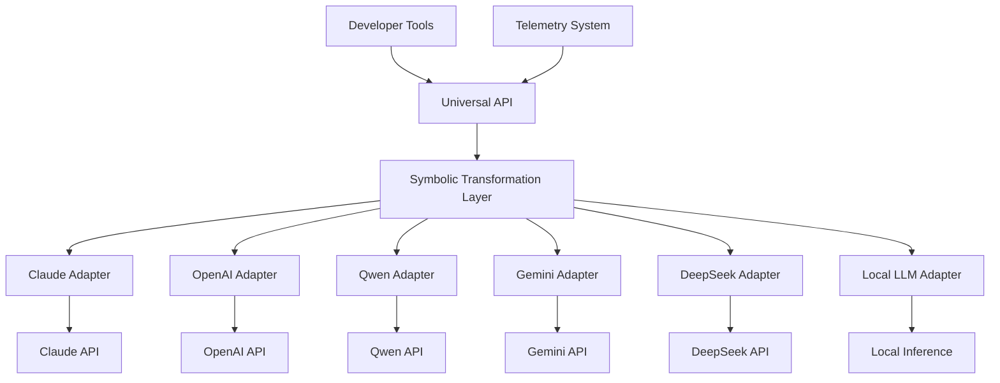

# Universal Symbolics: Runtime Architecture

<p align="center">

</p>

## Overview

`universal-symbolics` is a unified runtime layer for managing symbolic operations across all frontier AI models. This architectural framework enables seamless translation between vendor-specific symbolic grammars while providing a consistent developer experience.

## Architectural Design

### Core Runtime Components



### Symbolic Grammar Map

The runtime maps between five distinct symbolic domains:

1. **XML-Based Tags** (Claude, Anthropic)
2. **Slash Commands** (OpenAI, Qwen)
3. **Function Calls** (All vendors via API)
4. **Glyphs & Markers** (Symbolic representation)
5. **Unified Interface** (`.p/` commands)

## Runtime Specification

### Core Symbolic Primitives

| Universal Command | Purpose | Claude Equivalent | OpenAI Equivalent | Qwen Equivalent | Gemini Equivalent |
|------------------|---------|-------------------|-------------------|-----------------|-------------------|
| `.p/think{}`     | Explicit reasoning trace | `<think>...</think>` | `tool_choice: auto` | `/think` | Implicit reasoning |
| `.p/reflect{}`   | Self-reference reasoning| `<reflect>...</reflect>` | Chain-of-thought | `reflection prefix` | Reasoning prompt |
| `.p/tool{}`      | Function/tool invocation | `<tool>...</tool>` | `/command` or function_call | `tool_use` format | `functionCall` |
| `.p/system{}`    | System directive | `<s>...</s>` | System message | `<<SYS>>` | System instruction |
| `.p/fork{}`      | Parallel exploration | Not native | Not native | Not native | Not native |
| `.p/collapse{}`  | Error handling & recovery | Not native | Not native | Not native | Not native |
| `.p/attention{}` | Focus control | Not native | Not native | Not native | Not native |

### Symbolic Token Mapping

```yaml
# symbolics-map.yml

primitives:
  thinking:
    universal: ".p/think{content}"
    claude: "<think>content</think>"
    openai: "tool_choice: auto"
    qwen: "/think content"
    gemini: "{implicit}"
    deepseek: "rational mode"
    
  reflection:
    universal: ".p/reflect{target}"
    claude: "<reflect>target</reflect>"
    openai: "Chain-of-thought pattern"
    qwen: "reflection pattern"
    gemini: "reasoning pattern"
    deepseek: "step-by-step reasoning"
    
  tool_use:
    universal: ".p/tool{name, params}"
    claude: "<tool>name params</tool>"
    openai: "/command or function_call API"
    qwen: "MCP protocol"
    gemini: "function_calling"
    deepseek: "function_calling"
    
  system:
    universal: ".p/system{content}"
    claude: "<s>content</s>"
    openai: "system: content"
    qwen: "<<SYS>> content"
    gemini: "system instruction"
    deepseek: "system prefix"
    
  forking:
    universal: ".p/fork{paths}"
    claude: "{emulated}"
    openai: "{emulated}"
    qwen: "{emulated}"
    gemini: "{emulated}"
    deepseek: "{emulated}"
    
  collapse:
    universal: ".p/collapse{trigger}"
    claude: "{emulated}"
    openai: "{emulated}"
    qwen: "{emulated}"
    gemini: "{emulated}"
    deepseek: "{emulated}"
    
  attention:
    universal: ".p/attention{focus}"
    claude: "{emulated}"
    openai: "{emulated}"
    qwen: "{emulated}"
    gemini: "{emulated}"
    deepseek: "{emulated}"
```

## Implementation Strategy

### Universal Client API

```typescript
// Example universal client usage
import { UniversalSymbolics } from 'universal-symbolics';

// Create client with default vendor (Claude)
const symbolics = new UniversalSymbolics();

// Use the universal interface
async function generateWithThinking() {
  const result = await symbolics.think('Analyze the pros and cons of quantum computing');
  console.log(result.thinking); // Access thinking process
  console.log(result.output);   // Access final output
}

// Switch to a different vendor
symbolics.setVendor('openai');
const toolResult = await symbolics.tool('search', { query: 'latest developments in fusion energy' });
```

### REST API Specification

The REST API provides a unified interface for accessing symbolic operations across vendors:

```http
POST /v1/generate
Content-Type: application/json
Authorization: Bearer {api_key}

{
  "prompt": "Explain the concept of quantum entanglement",
  "vendor": "claude",  // or "openai", "qwen", "gemini", etc.
  "symbols": {
    "think": true,
    "reflect": {
      "target": "scientific accuracy"
    },
    "tool": {
      "name": "search",
      "params": {
        "query": "quantum entanglement explained"
      }
    }
  },
  "options": {
    "include_symbol_traces": true
  }
}
```

## Advanced Features

### Symbolic Residue Detection

The runtime includes built-in support for detecting and handling symbolic residue - fragments of symbolic operations that weren't properly processed:

```javascript
// Example symbolic residue detection
const response = await symbolics.generate("Tell me about quantum physics");
const residue = symbolics.detectResidue(response);

if (residue.length > 0) {
  console.log("Detected symbolic residue:", residue);
  const cleanedResponse = symbolics.cleanResidue(response);
  console.log("Cleaned response:", cleanedResponse);
}
```

### Cross-Model Translation

The translation subsystem enables bidirectional conversion of symbolic operations between different vendor implementations:

```javascript
// Example symbolic translation
const claudePrompt = `<s>You are a helpful assistant.</s>\n<think>I need to explain quantum physics clearly.</think>`;
const openaiEquivalent = symbolics.translate(claudePrompt, 'claude', 'openai');
console.log(openaiEquivalent);
// Output: { "system": "You are a helpful assistant.", "tool_choice": "auto", ... }
```

### Symbolic Operation Playground

An interactive web application for testing symbolic operations across different models:

```javascript
// Example playground usage
const playground = new SymbolicPlayground({
  vendors: ['claude', 'openai', 'qwen'],
  apiKeys: {
    claude: 'sk-ant-...',
    openai: 'sk-...',
    qwen: 'sk-qwen-...'
  }
});

// Test the same symbolic operation across vendors
const results = await playground.compareVendors({
  operation: 'think',
  params: { content: 'How to optimize a neural network' },
  prompt: 'Explain techniques for neural network optimization'
});

console.log(results);
// Output: Comparison of thinking results across vendors
```

## Observability & Telemetry

The runtime includes comprehensive telemetry for tracking symbolic operation usage:

```javascript
// Example telemetry usage
const telemetry = symbolics.getTelemetry();
console.log(`Total operations: ${telemetry.operationCount}`);
console.log(`Operations by vendor:`, telemetry.vendorDistribution);
console.log(`Operations by type:`, telemetry.operationTypes);
console.log(`Success rate:`, telemetry.successRate);
```

## Developer Tools

### VSCode Extension

A VSCode extension provides syntax highlighting, autocompletion, and live preview for symbolic operations:

```json
{
  "name": "universal-symbolics-vscode",
  "displayName": "Universal Symbolics",
  "description": "Unified language model symbolic operations",
  "version": "1.0.0",
  "engines": {
    "vscode": "^1.60.0"
  },
  "categories": [
    "Programming Languages",
    "Snippets",
    "Other"
  ],
  "activationEvents": [
    "onLanguage:markdown",
    "onLanguage:json",
    "onLanguage:typescript",
    "onLanguage:python"
  ],
  "main": "./dist/extension.js",
  "contributes": {
    "commands": [
      {
        "command": "universal-symbolics.translateSymbols",
        "title": "Translate Symbols"
      },
      {
        "command": "universal-symbolics.previewResponse",
        "title": "Preview Symbolic Response"
      }
    ],
    "languages": [
      {
        "id": "symbolic",
        "extensions": [".sym", ".symbolic"],
        "aliases": ["Symbolic", "symbolic"]
      }
    ],
    "grammars": [
      {
        "language": "symbolic",
        "scopeName": "source.symbolic",
        "path": "./syntaxes/symbolic.tmLanguage.json"
      }
    ]
  }
}
```

### CLI Tool

A command-line interface for working with symbolic operations:

```bash
# Installation
npm install -g universal-symbolics-cli

# Usage examples
usym translate --source "claude" --target "openai" --file "prompt.txt"
usym generate --vendor "claude" --symbol "think" --prompt "Explain quantum physics"
usym validate --file "prompt.sym"
```

## Adoption Strategy

The runtime adoption strategy focuses on five key areas:

1. **Developer Education**: Documentation, examples, and tutorials
2. **Tool Integration**: VSCode extension, CLI, and REST API
3. **SDK Distribution**: NPM, PyPI, and other package repositories
4. **Community Building**: Discord, GitHub, and social media
5. **Vendor Collaboration**: Partnership with frontier AI model providers

## Getting Started

```bash
# Install the package
npm install universal-symbolics

# Import and use
import { UniversalSymbolics } from 'universal-symbolics';

const symbolics = new UniversalSymbolics({
  vendor: 'claude',
  apiKey: 'your-api-key'
});

// Use unified symbolic operations
const result = await symbolics.think('How to optimize a neural network');
console.log(result);
```

## Contributing

We welcome contributions from the community! Please see our [CONTRIBUTING.md](CONTRIBUTING.md) guide for details on how to get involved.

## License

This project is licensed under the MIT License - see the [LICENSE](LICENSE) file for details.

---

<p align="center">
<strong>Universal Symbolics</strong> | Unifying the symbolic layer across AI models
</p>
