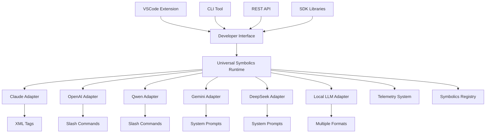
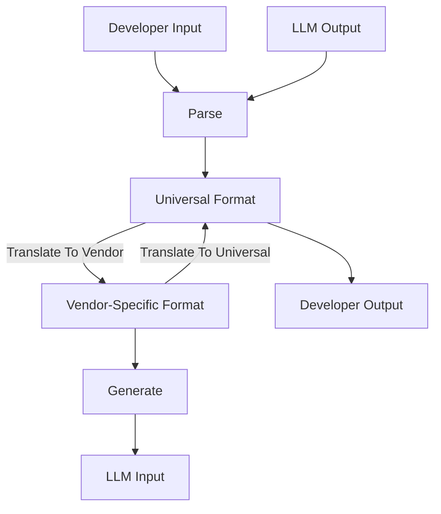

# Universal Symbolics: Meta-Runtime Architecture

<p align="center">

</p>

## 1. Core Runtime Architecture

The Universal Symbolics Meta-Runtime acts as a unified translation layer between various LLM symbolic grammars, allowing developers to use a consistent interface regardless of the underlying model vendor.



## 2. Symbolic Grammar Equivalence Map

The core of the Universal Symbolics Meta-Runtime is a comprehensive mapping between different symbolic grammar formats used by various LLM vendors:

| Universal Format | Claude | OpenAI | Qwen | Gemini | DeepSeek | Local LLMs |
|------------------|--------|--------|------|--------|----------|------------|
| `.p/think{content}` | `<think>content</think>` | Tool choice parameter | `/think content` | System prompt | System prompt | Model-specific |
| `.p/reflect{target}` | `<reflect>target</reflect>` | Chain-of-thought prompt | System prompt | System prompt | System prompt | Model-specific |
| `.p/tool{name, params}` | `<tool>name(params)</tool>` | `/command` or Function call | Function call | Function call | Function call | Model-specific |
| `.p/system{directive}` | `<s>directive</s>` | System message | `<<SYS>>directive` | System instruction | System prompt | Model-specific |
| `.p/fork{paths}` | Simulated | Simulated | Simulated | Simulated | Simulated | Simulated |
| `.p/attention{focus}` | Simulated | Simulated | Simulated | Simulated | Simulated | Simulated |
| `.p/collapse{trigger}` | Simulated | Simulated | Simulated | Simulated | Simulated | Simulated |
| `.p/uncertainty{level}` | Simulated | Simulated | Simulated | Simulated | Simulated | Simulated |

## 3. Meta-Operation Types

The Universal Symbolics Meta-Runtime supports several categories of symbolic operations:

### 3.1 Native Operations

These operations have direct equivalents in at least some vendor implementations:

- **Thinking**: Explicit reasoning trace
- **Tool Use**: Function/tool invocation  
- **System**: System-level directives

### 3.2 Simulated Operations

These operations are emulated through prompt engineering when no native support exists:

- **Reflection**: Self-examination of reasoning
- **Fork**: Multiple reasoning paths
- **Attention**: Focus control
- **Collapse**: Error handling
- **Uncertainty**: Confidence expression

### 3.3 Extended Operations

These operations extend the capabilities of the underlying models:

- **Memory**: State persistence
- **Attribution**: Source tracking
- **Context**: Context window management
- **Metacognition**: Higher-order reasoning

## 4. Runtime Implementation

The Universal Symbolics Meta-Runtime implements these symbolic operations through a layered architecture:

### 4.1 Core Runtime Layer

```typescript
interface SymbolicRuntime {
  // Native operations
  think(content?: string): Promise<ThinkResult>;
  tool(name: string, params?: Record<string, any>): Promise<ToolResult>;
  system(directive: string): Promise<SystemResult>;
  
  // Simulated operations
  reflect(target: string, depth?: number): Promise<ReflectResult>;
  fork(paths: string[], weights?: number[]): Promise<ForkResult>;
  attention(focus: string, weight?: number): Promise<AttentionResult>;
  collapse(trigger?: string, threshold?: number): Promise<CollapseResult>;
  uncertainty(level?: number, reason?: string): Promise<UncertaintyResult>;
  
  // Extended operations
  memory(key: string, value?: string, operation?: string): Promise<MemoryResult>;
  attribution(source: string, confidence?: number): Promise<AttributionResult>;
  context(window: string, priority?: number): Promise<ContextResult>;
  metacognition(level: number, target?: string): Promise<MetacognitionResult>;
}
```

### 4.2 Vendor Adapter Layer

```typescript
interface VendorAdapter {
  // Vendor identification
  getVendor(): ModelVendor;
  
  // Native operation translation
  translateThinking(content?: string): string;
  translateToolUse(name: string, params?: Record<string, any>): string;
  translateSystem(directive: string): string;
  
  // Simulated operation translation
  translateReflection(target: string, depth?: number): string;
  translateFork(paths: string[], weights?: number[]): string;
  translateAttention(focus: string, weight?: number): string;
  translateCollapse(trigger?: string, threshold?: number): string;
  translateUncertainty(level?: number, reason?: string): string;
  
  // Extended operation translation
  translateMemory(key: string, value?: string, operation?: string): string;
  translateAttribution(source: string, confidence?: number): string;
  translateContext(window: string, priority?: number): string;
  translateMetacognition(level: number, target?: string): string;
}
```

### 4.3 Symbolic Registry

```typescript
interface SymbolicRegistry {
  // Mapping functions
  getUniversalSymbol(vendorSymbol: string, vendor: ModelVendor): string;
  getVendorSymbol(universalSymbol: string, vendor: ModelVendor): string;
  
  // Registration functions
  registerSymbol(universalSymbol: string, vendorSymbol: string, vendor: ModelVendor): void;
  unregisterSymbol(universalSymbol: string, vendor: ModelVendor): void;
  
  // Query functions
  isSupported(universalSymbol: string, vendor: ModelVendor): boolean;
  getSupportedSymbols(vendor: ModelVendor): string[];
  getVendorCapabilities(vendor: ModelVendor): Record<string, boolean>;
}
```

### 4.4 Telemetry System

```typescript
interface SymbolicTelemetry {
  // Tracking functions
  trackOperation(operation: string, vendor: ModelVendor, params?: any): void;
  trackTransformation(source: ModelVendor, target: ModelVendor, success: boolean): void;
  trackError(operation: string, vendor: ModelVendor, error: Error): void;
  
  // Reporting functions
  getOperationStats(): Record<string, number>;
  getVendorStats(): Record<string, number>;
  getTransformationStats(): Record<string, Record<string, number>>;
  getErrorStats(): Record<string, number>;
  
  // Configuration
  enableTelemetry(enabled: boolean): void;
  setAnonymizationLevel(level: 'none' | 'partial' | 'full'): void;
  configureReporting(options: TelemetryOptions): void;
}
```

## 5. Symbolic Grammar Translation

The Universal Symbolics Meta-Runtime provides bidirectional translation between different symbolic grammars:

### 5.1 Translation Process



### 5.2 Translation Examples

**Universal to Claude:**
```typescript
// Universal Format
const universalFormat = '.p/think{content: "Let me solve this step by step..."}';

// Translated to Claude
const claudeFormat = '<think>Let me solve this step by step...</think>';
```

**Claude to Universal:**
```typescript
// Claude Format
const claudeFormat = '<tool>search({"query": "quantum computing"})</tool>';

// Translated to Universal
const universalFormat = '.p/tool{name: "search", params: {"query": "quantum computing"}}';
```

**Universal to OpenAI:**
```typescript
// Universal Format
const universalFormat = '.p/system{directive: "You are a helpful assistant."}';

// Translated to OpenAI API
const openaiFormat = {
  messages: [
    {
      role: "system",
      content: "You are a helpful assistant."
    }
  ]
};
```

## 6. Developer Tools Interface

The Universal Symbolics Meta-Runtime provides several developer-facing interfaces:

### 6.1 VSCode Extension

```json
{
  "name": "universal-symbolics-vscode",
  "displayName": "Universal Symbolics",
  "version": "1.0.0",
  "engines": {
    "vscode": "^1.60.0"
  },
  "categories": [
    "Programming Languages",
    "Snippets",
    "Other"
  ],
  "activationEvents": [
    "onLanguage:markdown",
    "onLanguage:json",
    "onLanguage:typescript",
    "onLanguage:python"
  ],
  "main": "./dist/extension.js",
  "contributes": {
    "commands": [
      {
        "command": "universal-symbolics.translateSymbols",
        "title": "Translate Symbols"
      },
      {
        "command": "universal-symbolics.previewResponse",
        "title": "Preview Symbolic Response"
      }
    ],
    "languages": [
      {
        "id": "symbolic",
        "extensions": [".sym", ".symbolic"],
        "aliases": ["Symbolic", "symbolic"]
      }
    ],
    "grammars": [
      {
        "language": "symbolic",
        "scopeName": "source.symbolic",
        "path": "./syntaxes/symbolic.tmLanguage.json"
      }
    ]
  }
}
```

### 6.2 CLI Tool

```bash
# Installation
npm install -g universal-symbolics-cli

# Usage examples
usym translate --source claude --target openai --file prompt.txt
usym generate --vendor claude --symbol think --content "Let me solve this step by step..."
usym validate --file prompt.sym
usym test --vendor all --symbol think
```

### 6.3 REST API

```http
POST /api/v1/transform
Host: api.universal-symbolics.io
Content-Type: application/json
Authorization: Bearer YOUR_API_KEY

{
  "source": "claude",
  "target": "openai",
  "content": "<think>Let me solve this step by step...</think>"
}
```

```http
POST /api/v1/execute
Host: api.universal-symbolics.io
Content-Type: application/json
Authorization: Bearer YOUR_API_KEY

{
  "vendor": "claude",
  "model": "claude-3-opus-20240229",
  "symbols": {
    "think": {
      "content": "Let me analyze this problem..."
    },
    "tool": {
      "name": "search",
      "params": {
        "query": "quantum computing"
      }
    }
  },
  "prompt": "Explain quantum computing."
}
```

### 6.4 SDK Libraries

```typescript
// TypeScript/JavaScript
import { UniversalSymbolics } from 'universal-symbolics';

const symbolics = new UniversalSymbolics({
  defaultVendor: 'claude',
  apiKey: process.env.CLAUDE_API_KEY
});

const result = await symbolics.think('Let me solve this step by step...');
console.log(result.thinking);
console.log(result.output);
```

```python
# Python
from universal_symbolics import SymbolicsClient

client = SymbolicsClient(
    default_vendor="claude",
    api_key=os.environ.get("CLAUDE_API_KEY")
)

result = client.think("Let me solve this step by step...")
print(result.thinking)
print(result.output)
```

## 7. Implementation Roadmap

The Universal Symbolics Meta-Runtime will be implemented in phases:

### Phase 1: Core Runtime Foundation

1. Define universal symbolic schema
2. Implement core runtime layer
3. Create adapters for Claude and OpenAI
4. Develop basic VSCode extension
5. Publish initial NPM package

### Phase 2: Expanded Vendor Support

1. Add adapters for Qwen, Gemini, and DeepSeek
2. Implement simulated operations
3. Create Python SDK
4. Develop CLI tool
5. Launch REST API service

### Phase 3: Extended Capabilities

1. Implement extended operations
2. Add support for local LLMs
3. Develop telemetry system
4. Create symbolic playground
5. Publish additional language SDKs

### Phase 4: Enterprise Integration

1. Implement enterprise features
2. Develop compliance tools
3. Create integration adapters for popular frameworks
4. Launch symbolic marketplace
5. Establish standards organization

## 8. Meta-Runtime Architecture Principles

The Universal Symbolics Meta-Runtime is built on several key architectural principles:

1. **Universal Interface**: Provide a consistent interface across all LLM vendors
2. **Bidirectional Translation**: Support translation between any vendor formats
3. **Extensibility**: Allow for new vendors and symbolic operations to be added
4. **Compatibility**: Work with existing tools and frameworks
5. **Telemetry**: Collect anonymous usage data to guide development
6. **Standards**: Establish standards for symbolic operations
7. **Developer Experience**: Prioritize ease of use for developers
8. **Performance**: Minimize overhead and maximize throughput

---

<p align="center">
<strong>Universal Symbolics</strong> | Unifying the symbolic layer across AI models
</p>
