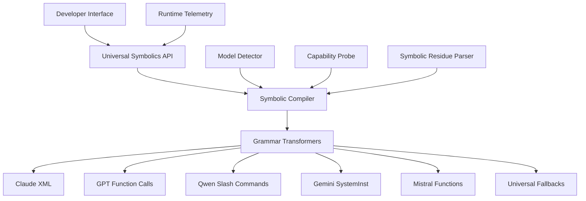

# Universal Symbolics Runtime

<div align="center">
<h2>🔄 The Multi-Model Symbolic Runtime Engine 🔄</h2>
<p><i>Universal symbolic control layer for all LLM environments</i></p>
</div>

## 1. Core Runtime Architecture

The Universal Symbolics Runtime provides a standardized layer for symbolic operations across all LLM platforms, ensuring compatibility, consistency, and developer ergonomics.



## 2. Minimal Viable Symbolics

After extensive cross-vendor analysis, we've identified the following minimal viable symbolic primitives required for universal compatibility:

```yaml
# symbolics-core.yml

runtime:
  version: "1.0.0"
  
  core_primitives:
    - id: "think"
      purpose: "Explicit reasoning instruction"
      universal_symbol: "🧠/"
      runtime_symbol: "🜏"
      vendors:
        claude: "<think>...</think>"
        openai: "tool_choice: 'thinking'"
        qwen: "/think"
        gemini: "$think"
        mistral: "function: think()"
        fallback: "# Thinking:\n"
    
    - id: "trace"
      purpose: "Process tracing"
      universal_symbol: "🔍/"
      runtime_symbol: "∴"
      vendors:
        claude: "<trace>...</trace>"
        openai: "tool_choice: 'trace'"
        qwen: "/trace"
        gemini: "$trace"
        mistral: "function: trace()"
        fallback: "# Tracing:\n"
    
    - id: "reflect"
      purpose: "Self-examination"
      universal_symbol: "🔄/"
      runtime_symbol: "↻"
      vendors:
        claude: "<reflect>...</reflect>"
        openai: "tool_choice: 'reflect'"
        qwen: "/reflect"
        gemini: "$reflect"
        mistral: "function: reflect()"
        fallback: "# Reflecting:\n"
    
    - id: "fork"
      purpose: "Parallel processing paths"
      universal_symbol: "🔱/"
      runtime_symbol: "⦿"
      vendors:
        claude: "<fork>...</fork>"
        openai: "tool_choice: 'fork'"
        qwen: "/fork"
        gemini: "$fork"
        mistral: "function: fork()"
        fallback: "# Path exploration:\n"
    
    - id: "collapse"
      purpose: "Error handling"
      universal_symbol: "⚠️/"
      runtime_symbol: "⟁"
      vendors:
        claude: "<collapse>...</collapse>"
        openai: "tool_choice: 'collapse'"
        qwen: "/collapse"
        gemini: "$collapse"
        mistral: "function: collapse()"
        fallback: "# Error handling:\n"
```

## 3. Grammar Transformation Engine

The Grammar Transformation Engine is the core component that converts between universal and vendor-specific symbolic formats:

```typescript
// universal-symbolics/src/transformers/grammar.ts

export class GrammarTransformer {
  private modelDetector: ModelDetector;
  private symbolRegistry: SymbolRegistry;
  private capabilityProbe: CapabilityProbe;
  
  constructor(options: TransformerOptions = {}) {
    this.modelDetector = new ModelDetector();
    this.symbolRegistry = new SymbolRegistry();
    this.capabilityProbe = new CapabilityProbe(options.probeEnabled ?? true);
  }
  
  /**
   * Transform universal symbolic syntax to vendor-specific format
   */
  async toVendorFormat(
    input: string,
    vendorType: VendorType | 'auto' = 'auto',
    options: TransformOptions = {}
  ): Promise<string> {
    // Auto-detect vendor if not specified
    const vendor = vendorType === 'auto' 
      ? await this.modelDetector.detectVendor(input) 
      : vendorType;
    
    // Extract symbolic operations from input
    const operations = this.extractSymbolicOperations(input);
    
    // Probe vendor capabilities if enabled
    if (options.probeCapabilities !== false) {
      await this.capabilityProbe.probeVendor(vendor);
    }
    
    // Transform each operation to vendor format
    for (const op of operations) {
      const vendorSyntax = this.symbolRegistry.getVendorSyntax(op.symbol, vendor);
      input = this.replaceSymbol(input, op, vendorSyntax, vendor);
    }
    
    // Apply vendor-specific post-processing
    return this.applyVendorPostProcessing(input, vendor);
  }
  
  /**
   * Transform vendor-specific format to universal symbolic syntax
   */
  toUniversalFormat(
    input: string,
    vendorType: VendorType | 'auto' = 'auto',
    options: TransformOptions = {}
  ): string {
    // Auto-detect vendor if not specified
    const vendor = vendorType === 'auto' 
      ? this.modelDetector.detectVendorSync(input) 
      : vendorType;
    
    // Extract vendor-specific operations
    const vendorOperations = this.extractVendorOperations(input, vendor);
    
    // Transform each operation to universal format
    for (const op of vendorOperations) {
      const universalSymbol = this.symbolRegistry.getUniversalSymbol(op.vendorSymbol, vendor);
      input = this.replaceVendorSymbol(input, op, universalSymbol, vendor);
    }
    
    // Apply universal format post-processing
    return this.applyUniversalPostProcessing(input);
  }
  
  // Additional helper methods...
}
```

## 4. Universal Symbolic Syntax Schema

The following schema defines the universal symbolic syntax that forms the basis of the runtime:

```yaml
# schema/universal-syntax.yml

syntax:
  version: "1.0.0"
  
  command_patterns:
    - pattern: "/domain.operation{params}"
      example: "/think.trace{depth: 2, format: 'detailed'}"
      description: "Full command with parameters"
    
    - pattern: "/domain.operation"
      example: "/think.trace"
      description: "Command without parameters"
    
    - pattern: "/operation"
      example: "/think"
      description: "Simplified operation without domain"
  
  glyph_patterns:
    - pattern: "🔍/{params}"
      example: "🔍/{depth: 2}"
      description: "Command glyph with parameters"
    
    - pattern: "🔍/"
      example: "🔍/"
      description: "Command glyph without parameters"
    
    - pattern: "🜏"
      example: "🜏"
      description: "Runtime glyph (concise)"
  
  parameter_formats:
    object:
      pattern: "{key1: value1, key2: value2}"
      description: "Object parameter format"
    
    simplified:
      pattern: ":value"
      description: "Simplified single parameter format"
    
    named:
      pattern: ":param=value"
      description: "Named parameter format"
  
  composition:
    chaining:
      pattern: "/op1 | /op2"
      description: "Chain operations with pipe"
    
    nesting:
      pattern: "/op1{/op2}"
      description: "Nest operations within parameters"
```

## 5. API Architecture

The Universal Symbolics API provides a clean, consistent interface for developers:

```typescript
// universal-symbolics/src/api/index.ts

export class UniversalSymbolics {
  private transformer: GrammarTransformer;
  private runtime: SymbolicsRuntime;
  private telemetry: TelemetrySystem;
  
  constructor(options: SymbolicsOptions = {}) {
    this.transformer = new GrammarTransformer(options.transformer);
    this.runtime = new SymbolicsRuntime(options.runtime);
    this.telemetry = new TelemetrySystem(options.telemetry);
  }
  
  /**
   * Execute a symbolic operation directly
   */
  async execute(
    operation: string,
    params: Record<string, any> = {},
    options: ExecuteOptions = {}
  ): Promise<SymbolicResult> {
    // Track operation telemetry
    this.telemetry.trackOperation(operation, params);
    
    // Parse operation
    const { domain, action } = this.parseOperation(operation);
    
    // Get domain executor
    const executor = this.runtime.getDomainExecutor(domain);
    
    // Execute operation
    const result = await executor.execute(action, params, options);
    
    // Track operation result
    this.telemetry.trackResult(operation, result);
    
    return result;
  }
  
  /**
   * Transform content containing symbolic operations
   */
  async transform(
    content: string,
    targetVendor: VendorType | 'auto' = 'auto',
    options: TransformOptions = {}
  ): Promise<TransformResult> {
    // Track transformation telemetry
    this.telemetry.trackTransformation(content, targetVendor);
    
    // Execute transformation
    const transformed = await this.transformer.toVendorFormat(
      content,
      targetVendor,
      options
    );
    
    return {
      original: content,
      transformed,
      targetVendor: targetVendor === 'auto' 
        ? await this.transformer.modelDetector.detectVendor(content)
        : targetVendor,
      operations: this.transformer.extractSymbolicOperations(content)
    };
  }
  
  /**
   * Reverse transform from vendor-specific to universal format
   */
  reverseTransform(
    content: string,
    sourceVendor: VendorType | 'auto' = 'auto',
    options: TransformOptions = {}
  ): ReverseTransformResult {
    // Execute reverse transformation
    const transformed = this.transformer.toUniversalFormat(
      content,
      sourceVendor,
      options
    );
    
    return {
      original: content,
      transformed,
      sourceVendor: sourceVendor === 'auto'
        ? this.transformer.modelDetector.detectVendorSync(content)
        : sourceVendor,
      operations: this.transformer.extractVendorOperations(content, sourceVendor)
    };
  }
  
  /**
   * Get domain-specific operations
   */
  get think() { return this.createDomainProxy('think'); }
  get reflect() { return this.createDomainProxy('reflect'); }
  get collapse() { return this.createDomainProxy('collapse'); }
  get fork() { return this.createDomainProxy('fork'); }
  get shell() { return this.createDomainProxy('shell'); }
  get inject() { return this.createDomainProxy('inject'); }
  get anchor() { return this.createDomainProxy('anchor'); }
  get align() { return this.createDomainProxy('align'); }
  // Additional domains...
  
  // Helper to create domain-specific operation proxies
  private createDomainProxy(domain: string) {
    return new Proxy({}, {
      get: (_, action: string) => {
        return (params = {}, options = {}) => 
          this.execute(`${domain}.${action}`, params, options);
      }
    });
  }
}
```

## 6. Symbolic Runtime Operations Registry

The complete list of supported symbolic operations:

```yaml
# registry/operations.yml

operations:
  think:
    core:
      description: "Core thinking operation"
      parameters:
        depth: "Thinking depth (1-5)"
        format: "Output format (text, structured, detailed)"
      returns: "Explicit reasoning trace"
    
    trace:
      description: "Trace reasoning pathways"
      parameters:
        steps: "Number of steps to trace"
        focus: "Area of focus for tracing"
      returns: "Step-by-step reasoning trace"
    
    analyze:
      description: "Analyze specific elements"
      parameters:
        target: "Target of analysis"
        framework: "Analysis framework to use"
      returns: "Detailed analysis"
  
  reflect:
    core:
      description: "Core reflection operation"
      parameters:
        target: "Target of reflection"
        depth: "Reflection depth (1-5)"
      returns: "Self-examination results"
    
    process:
      description: "Reflect on processing"
      parameters:
        stage: "Processing stage to reflect on"
      returns: "Processing reflection"
    
    attention:
      description: "Reflect on attention"
      parameters:
        focus: "Area of focus"
      returns: "Attention patterns"
  
  collapse:
    detect:
      description: "Detect potential issues"
      parameters:
        triggers: "Issue triggers to look for"
        threshold: "Detection threshold (0-1)"
      returns: "Detection results"
    
    recover:
      description: "Recover from issues"
      parameters:
        strategy: "Recovery strategy"
      returns: "Recovery results"
    
    stabilize:
      description: "Stabilize processing"
      parameters:
        method: "Stabilization method"
      returns: "Stabilization results"
  
  fork:
    create:
      description: "Create processing fork"
      parameters:
        paths: "Paths to explore"
        weights: "Path weights"
      returns: "Fork results"
    
    select:
      description: "Select best path"
      parameters:
        criterion: "Selection criterion"
      returns: "Selected path"
    
    merge:
      description: "Merge forked paths"
      parameters:
        strategy: "Merge strategy"
      returns: "Merged results"
  
  # Additional domains and operations...
```

## 7. Model Capability Detection System

The Capability Detection System enables adaptive behavior based on vendor capabilities:

```typescript
// universal-symbolics/src/detection/capabilities.ts

export class CapabilityProbe {
  private capabilityCache: Map<VendorType, VendorCapabilities>;
  private enabled: boolean;
  
  constructor(enabled: boolean = true) {
    this.capabilityCache = new Map();
    this.enabled = enabled;
  }
  
  /**
   * Probe vendor for supported symbolic capabilities
   */
  async probeVendor(
    vendor: VendorType, 
    forceRefresh: boolean = false
  ): Promise<VendorCapabilities> {
    // Return cached capabilities if available
    if (!forceRefresh && this.capabilityCache.has(vendor)) {
      return this.capabilityCache.get(vendor)!;
    }
    
    if (!this.enabled) {
      // Return default capabilities if probing is disabled
      return this.getDefaultCapabilities(vendor);
    }
    
    try {
      // Probe capabilities based on vendor type
      const capabilities = await this.executeProbe(vendor);
      this.capabilityCache.set(vendor, capabilities);
      return capabilities;
    } catch (error) {
      console.warn(`Failed to probe capabilities for ${vendor}:`, error);
      // Fall back to default capabilities
      return this.getDefaultCapabilities(vendor);
    }
  }
  
  /**
   * Execute capability probe for specific vendor
   */
  private async executeProbe(vendor: VendorType): Promise<VendorCapabilities> {
    // Create probing strategy for vendor
    const strategy = this.createProbeStrategy(vendor);
    
    // Execute probes in sequence
    const results = await Promise.all([
      strategy.probeCore(),
      strategy.probeReflection(),
      strategy.probeTracing(),
      strategy.probeForking(),
      strategy.probeCollapse()
    ]);
    
    // Compile capabilities
    return {
      vendor,
      timestamp: Date.now(),
      core: results[0],
      reflection: results[1],
      tracing: results[2],
      forking: results[3],
      collapse: results[4],
      // Additional capability areas...
    };
  }
  
  /**
   * Create vendor-specific probe strategy
   */
  private createProbeStrategy(vendor: VendorType): ProbeStrategy {
    switch (vendor) {
      case 'claude':
        return new ClaudeProbeStrategy();
      case 'openai':
        return new OpenAIProbeStrategy();
      case 'gemini':
        return new GeminiProbeStrategy();
      case 'qwen':
        return new QwenProbeStrategy();
      case 'mistral':
        return new MistralProbeStrategy();
      default:
        return new GenericProbeStrategy();
    }
  }
  
  /**
   * Get default capabilities for vendor
   */
  private getDefaultCapabilities(vendor: VendorType): VendorCapabilities {
    // Return predefined capabilities based on vendor
    switch (vendor) {
      case 'claude':
        return CLAUDE_DEFAULT_CAPABILITIES;
      case 'openai':
        return OPENAI_DEFAULT_CAPABILITIES;
      case 'gemini':
        return GEMINI_DEFAULT_CAPABILITIES;
      case 'qwen':
        return QWEN_DEFAULT_CAPABILITIES;
      case 'mistral':
        return MISTRAL_DEFAULT_CAPABILITIES;
      default:
        return GENERIC_DEFAULT_CAPABILITIES;
    }
  }
}
```

## 8. Vendor Adapter System

The Vendor Adapter System provides model-specific optimizations:

```typescript
// universal-symbolics/src/vendors/index.ts

export abstract class VendorAdapter {
  protected options: VendorAdapterOptions;
  
  constructor(options: VendorAdapterOptions = {}) {
    this.options = options;
  }
  
  abstract transformToVendor(
    input: string, 
    operations: SymbolicOperation[]
  ): string;
  
  abstract transformFromVendor(
    input: string
  ): { content: string; operations: VendorOperation[] };
  
  abstract executeOperation(
    operation: string,
    params: Record<string, any>,
    options: ExecuteOptions
  ): Promise<SymbolicResult>;
}

export class ClaudeAdapter extends VendorAdapter {
  transformToVendor(
    input: string, 
    operations: SymbolicOperation[]
  ): string {
    let result = input;
    
    for (const op of operations) {
      const { domain, action, params } = op;
      
      // Convert to Claude XML syntax
      let xmlTag = '';
      switch (`${domain}.${action}`) {
        case 'think.core':
          xmlTag = 'think';
          break;
        case 'reflect.core':
          xmlTag = 'reflect';
          break;
        case 'reflect.attention':
          xmlTag = 'attention';
          break;
        // Map other operations to XML tags
        default:
          xmlTag = this.getDefaultXmlTag(domain, action);
      }
      
      // Replace symbol with XML tag
      result = this.replaceWithXml(result, op, xmlTag, params);
    }
    
    return result;
  }
  
  transformFromVendor(input: string): { 
    content: string; 
    operations: VendorOperation[] 
  } {
    const operations: VendorOperation[] = [];
    let content = input;
    
    // Extract XML tags
    const xmlTagRegex = /<(\w+)(?:\s+([^>]*))?>([\s\S]*?)<\/\1>/g;
    let match;
    
    while ((match = xmlTagRegex.exec(input)) !== null) {
      const [full, tag, attrsStr, innerContent] = match;
      
      // Parse attributes if present
      const attrs = attrsStr ? this.parseXmlAttributes(attrsStr) : {};
      
      // Map XML tag to universal operation
      const { domain, action } = this.mapXmlTagToOperation(tag);
      
      operations.push({
        vendorSymbol: tag,
        domain,
        action,
        params: attrs,
        content: innerContent,
        position: {
          start: match.index,
          end: match.index + full.length
        }
      });
      
      // Replace XML tag with placeholder
      content = content.replace(
        full, 
        `[SYMBOLIC:${operations.length - 1}]`
      );
    }
    
    return { content, operations };
  }
  
  async executeOperation(
    operation: string,
    params: Record<string, any>,
    options: ExecuteOptions
  ): Promise<SymbolicResult> {
    // Implementation for Claude-specific execution
    // ...
  }
  
  // Helper methods
  private getDefaultXmlTag(domain: string, action: string): string {
    // Default mapping strategy
    return `${domain}_${action}`;
  }
  
  private replaceWithXml(
    content: string, 
    operation: SymbolicOperation,
    tag: string,
    params: Record<string, any>
  ): string {
    // Implementation for XML replacement
    // ...
  }
  
  private parseXmlAttributes(attrs: string): Record<string, any> {
    // Parse XML attributes
    // ...
  }
  
  private mapXmlTagToOperation(
    tag: string
  ): { domain: string; action: string } {
    // Map XML tag to operation
    // ...
  }
}

// Additional adapter implementations for other vendors
export class OpenAIAdapter extends VendorAdapter { /* ... */ }
export class GeminiAdapter extends VendorAdapter { /* ... */ }
export class QwenAdapter extends VendorAdapter { /* ... */ }
export class MistralAdapter extends VendorAdapter { /* ... */ }
```

## 9. Residue Parser System

The Residue Parser System extracts and processes symbolic residue:

```typescript
// universal-symbolics/src/parsers/residue.ts

export class ResidueParser {
  private registry: ResiduePatternRegistry;
  
  constructor() {
    this.registry = new ResiduePatternRegistry();
  }
  
  /**
   * Extract symbolic residue from model output
   */
  extractResidue(
    content: string,
    vendor: VendorType,
    options: ResidueOptions = {}
  ): ResidueResult {
    // Get vendor-specific patterns
    const patterns = this.registry.getPatternsForVendor(vendor);
    
    const residueInstances: ResidueInstance[] = [];
    
    // Apply each pattern
    for (const pattern of patterns) {
      const matches = this.findPatternMatches(content, pattern);
      
      for (const match of matches) {
        residueInstances.push({
          type: pattern.type,
          subtype: pattern.subtype,
          content: match.content,
          position: match.position,
          confidence: this.calculateConfidence(match, pattern),
          metadata: this.extractMetadata(match, pattern)
        });
      }
    }
    
    // Process and classify residue
    return this.processResidue(residueInstances, options);
  }
  
  /**
   * Find matches for a specific residue pattern
   */
  private findPatternMatches(
    content: string,
    pattern: ResiduePattern
  ): PatternMatch[] {
    const matches: PatternMatch[] = [];
    
    // Apply regex pattern
    const regex = new RegExp(pattern.regex, 'g');
    let match;
    
    while ((match = regex.exec(content)) !== null) {
      matches.push({
        content: match[0],
        groups: match.groups || {},
        position: {
          start: match.index,
          end: match.index + match[0].length
        }
      });
    }
    
    return matches;
  }
  
  /**
   * Calculate confidence score for a residue match
   */
  private calculateConfidence(
    match: PatternMatch,
    pattern: ResiduePattern
  ): number {
    // Calculate base confidence
    let confidence = pattern.baseConfidence || 0.7;
    
    // Apply modifiers based on pattern characteristics
    if (pattern.confidenceModifiers) {
      for (const modifier of pattern.confidenceModifiers) {
        if (modifier.condition(match)) {
          confidence *= modifier.factor;
        }
      }
    }
    
    return Math.min(1, Math.max(0, confidence));
  }
  
  /**
   * Extract metadata from residue match
   */
  private extractMetadata(
    match: PatternMatch,
    pattern: ResiduePattern
  ): Record<string, any> {
    const metadata: Record<string, any> = {};
    
    // Extract metadata based on pattern
    if (pattern.metadataExtractors) {
      for (const [key, extractor] of Object.entries(pattern.metadataExtractors)) {
        metadata[key] = extractor(match);
      }
    }
    
    return metadata;
  }
  
  /**
   * Process and classify extracted residue
   */
  private processResidue(
    instances: ResidueInstance[],
    options: ResidueOptions
  ): ResidueResult {
    // Filter by confidence threshold
    const threshold = options.confidenceThreshold || 0.5;
    const filtered = instances.filter(inst => inst.confidence >= threshold);
    
    // Group by type
    const byType = this.groupByType(filtered);
    
    // Calculate summary statistics
    const statistics = this.calculateStatistics(filtered);
    
    return {
      instances: filtered,
      byType,
      statistics,
      vendorFingerprint: this.generateVendorFingerprint(filtered)
    };
  }
  
  // Additional helper methods...
}
```

## 10. Global Telemetry System

The Global Telemetry System measures symbolic usage patterns and adoption metrics:

```typescript
// universal-symbolics/src/telemetry/index.ts

export class TelemetrySystem {
  private options: TelemetryOptions;
  private metrics: TelemetryMetrics;
  private reportingEndpoint?: string;
  
  constructor(options: TelemetryOptions = {}) {
    this.options = {
      enabled: options.enabled ?? false,
      anonymize: options.anonymize ?? true,
      reportingInterval: options.reportingInterval ?? 3600000, // 1 hour
      ...options
    };
    
    this.reportingEndpoint = options.reportingEndpoint;
    
    this.metrics = {
      operations: new Map(),
      vendors: new Map(),
      transformations: new Map(),
      errors: new Map(),
      residue: new Map(),
      usageTimestamps: []
    };
    
    // Schedule periodic reporting if enabled
    if (this.options.enabled && this.reportingEndpoint) {
      this.scheduleReporting();
    }
  }
  
  /**
   * Track symbolic operation usage
   */
  trackOperation(
    operation: string, 
    params: Record<string, any> = {}
  ): void {
    if (!this.options.enabled) return;
    
    // Increment operation count
    const count = (this.metrics.operations.get(operation) || 0) + 1;
    this.metrics.operations.set(operation, count);
    
    // Record timestamp
    this.metrics.usageTimestamps.push(Date.now());
    
    // Prune old timestamps
    this.pruneTimestamps();
  }
  
  /**
   * Track operation result
   */
  trackResult(
    operation: string,
    result: SymbolicResult
  ): void {
    if (!this.options.enabled) return;
    
    // Track successful/failed operations
    if (result.success) {
      const key = `${operation}.success`;
      const count = (this.metrics.operations.get(key) || 0) + 1;
      this.metrics.operations.set(key, count);
    } else {
      const key = `${operation}.error`;
      const count = (this.metrics.operations.get(key) || 0) + 1;
      this.metrics.operations.set(key, count);
      
      // Track error types
      if (result.error) {
        const errorType = result.error.type || 'unknown';
        const count = (this.metrics.errors.get(errorType) || 0) + 1;
        this.metrics.errors.set(errorType, count);
      }
    }
  }
  
  /**
   * Track vendor usage
   */
  trackVendor(vendor: VendorType): void {
    if (!this.options.enabled) return;
    
    // Increment vendor usage count
    const count = (this.metrics.vendors.get(vendor) || 0) + 1;
    this.metrics.vendors.set(vendor, count);
  }
  
  /**
   * Track transformation operations
   */
  trackTransformation(
    content: string,
    targetVendor: VendorType | 'auto'
  ): void {
    if (!this.options.enabled) return;
    
    // Increment transformation count
    const key = targetVendor === 'auto' ? 'auto' : targetVendor;
    const count = (this.metrics.transformations.get(key) || 0) + 1;
    this.metrics.transformations.set(key, count);
  }
  
  /**
   * Track residue detection
   */
  trackResidue(
    residueType: string,
    vendor: VendorType
  ): void {
    if (!this.options.enabled) return;
    
    // Increment residue count
    const key = `${vendor}.${residueType}`;
    const count = (this.metrics.residue.get(key) || 0) + 1;
    this.metrics.residue.set(key, count);
  }
  
  /**
   * Get current metrics
   */
  getMetrics(): TelemetryReport {
    return {
      timestamp: Date.now(),
      operations: Object.fromEntries(this.metrics.operations),
      vendors: Object.fromEntries(this.metrics.vendors),
      transformations: Object.fromEntries(this.metrics.transformations),
      errors: Object.fromEntries(this.metrics.errors),
      residue: Object.fromEntries(this.metrics.residue),
      activeUsersLastHour: this.countRecentUsage(3600000), // 1 hour
      activeUsersLastDay: this.countRecentUsage(86400000)  // 24 hours
    };
  }
  
  /**
   * Report telemetry data to remote endpoint
   */
  async reportTelemetry(): Promise<boolean> {
    if (!this.options.enabled || !this.reportingEndpoint) {
      return false;
    }
    
    try {
      const report = this.getMetrics();
      
      // Anonymize if required
      const payload = this.options.anonymize ? 
        this.anonymizeReport(report) : report;
      
      // Send to reporting endpoint
      const response = await
